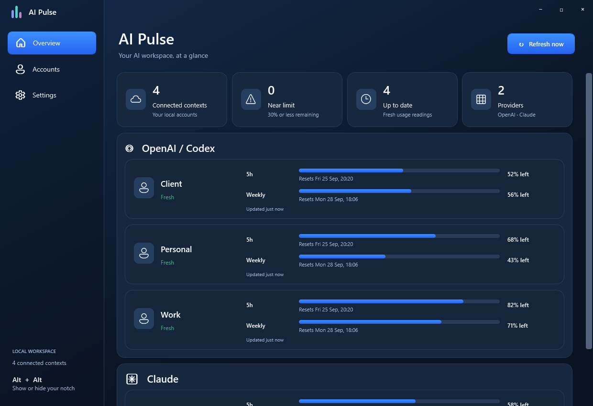

# AI Pulse

AI Pulse is a Windows tray app that shows how much of your **Codex** and **Claude Code** subscription usage remains. It watches multiple existing accounts, shows their five-hour and weekly windows in a small notch, refreshes readings, and can alert you when a limit is close.

## The notch


The collapsed notch shows the selected Codex and Claude accounts at a glance. Expand it to see every account and its usage windows:


## Main window



These screenshots use sample accounts and usage values. See the [Accounts page](docs/screenshots/accounts-1.0.5.png).

## Download

**[Get the latest release](https://github.com/mokiwara/Ai-Pulse/releases/latest)**. Version 1.0.5 includes:

| File | Purpose |
| --- | --- |
| [AI-Pulse-1.0.5-Setup.exe](https://github.com/mokiwara/Ai-Pulse/releases/download/v1.0.5/AI-Pulse-1.0.5-Setup.exe) | Recommended installer; selects x64 or ARM64 automatically. |
| [AI-Pulse-1.0.5-win-x64-Portable.exe](https://github.com/mokiwara/Ai-Pulse/releases/download/v1.0.5/AI-Pulse-1.0.5-win-x64-Portable.exe) | Portable app for x64 Windows. |
| [AI-Pulse-1.0.5-win-arm64-Portable.exe](https://github.com/mokiwara/Ai-Pulse/releases/download/v1.0.5/AI-Pulse-1.0.5-win-arm64-Portable.exe) | Portable app for ARM64 Windows. |

Windows 10 version 1809 or newer is the technical minimum. The downloads include .NET, but **Codex and/or Claude Code must be installed and signed in separately**. Claude Code 2.1.251 or newer is needed for its subscription usage feed. The executables are unsigned; Windows may show an unknown publisher warning. The release includes SHA-256 checksums and [distribution details](docs/DISTRIBUTION.txt).

## Get started

1. Install AI Pulse or run the portable executable for your Windows architecture.
2. Open **Accounts**. AI Pulse looks for existing Codex and Claude Code contexts. Choose **Add existing context** to monitor another authenticated `CODEX_HOME` or `CLAUDE_CONFIG_DIR` directory.
3. Select **Refresh now**. The overview shows remaining percentages, reset times, and whether each reading is fresh or stale.
4. Use **Settings > Notch** to choose which account from each provider appears in the collapsed notch. Double-tap **Alt** to show or hide it.

Closing the main window leaves AI Pulse running in the system tray. The tray menu opens the app, refreshes readings, toggles the notch, or exits. The notch's circular arrow refreshes without opening the window. Automatic refresh defaults to two minutes; **Settings > Refresh** offers 1, 2, 5, 10, and 15 minutes. Alerts can notify at 30%, 15%, or 5% remaining.

Read the **[user guide](docs/USER-GUIDE.md)** for account setup, display states, troubleshooting, portable use, privacy, and uninstalling.

## How it works

- **Codex:** AI Pulse uses an isolated `codex app-server --stdio` child process to read account and rate-limit information from each existing Codex home.
- **Claude Code:** AI Pulse checks authentication with `claude auth status` and reads shared subscription usage through Claude Code's `/usage` command. Optional terminal capture can observe normalized usage from Claude Code's status-line feed after you enable it for a selected context.
- **Privacy:** There is no AI Pulse account, cloud backend, telemetry, or provider credential store. Settings, context paths, and normalized usage readings stay under `%LOCALAPPDATA%\AIUsageHub`. Provider CLIs own login and communicate with their respective services.

AI Pulse reports what the provider tools return. A failed or changed provider response can leave the last reading marked stale.

## Build from source

On Windows, install the .NET 10 SDK, then run:

```powershell
dotnet test AIUsageHub.slnx -c Release
dotnet run --project src/AIUsageHub.App/AIUsageHub.App.csproj -c Release
```

The release pipeline is in [`scripts/release.ps1`](scripts/release.ps1); it expects a local SDK in `.tools/dotnet` and a verified Inno Setup compiler in `.tools/InnoSetup`. See the [production review](docs/production/REVIEW.md) for test scope and release limitations. Architecture and implementation notes are in [`docs/`](docs/00-product-brief.md).
