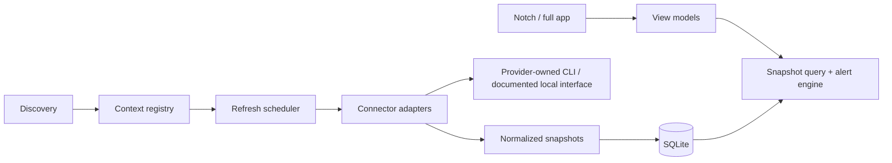

# Application architecture

> **Phase 1 implementation (24 September 2026):** The OpenAI/Codex app is implemented in one compact WPF project plus one test project. This consolidates the four production assemblies proposed below for the single-connector phase. See [implementation record](17-phase1-implementation.md). Claude remains Phase 2.

## Recommendation

Use **C# / .NET 10 + WPF** for a single per-user desktop process. Add narrow Win32 interop for HWND behavior, monitor placement, tray, and notification activation. Use SQLite for small local metadata and latest normalized snapshots. Prefer no Windows service: a per-user background process has the correct provider context and can own the tray/notch; a service would add privilege, session, and UI isolation problems. [Framework decision](adr/ADR-001-language-and-ui-framework.md), [SQLite decision](adr/ADR-002-database.md).



**Trust boundary:** AI Usage Hub launches or observes a provider-owned tool that owns its own authentication. The hub receives a narrow usage result; it never imports a provider credential. Only allow-listed executables, arguments, environment keys, and read-only methods may run. Source-specific data is normalized before persistence. Connector failures cannot be confused with 0% usage.

## Processes and lifetime

One WPF process starts at user login, enforces one instance per Windows user session, shows a tray icon, schedules refreshes, and hosts the notch and settings window. Child CLI processes are short-lived, per-context, with cancellation/timeout, constrained output size, and stdout parsing. No generic shell. A live Claude status-line bridge is an opt-in local handoff from an existing Claude Code session; it never launches a model turn. Keep a background process only while user opted into startup. Show a clear Quit action.

At startup: load SQLite, render last snapshots **stale**, discover known tools/config roots, verify each context through provider-owned safe commands, then schedule refresh. User-provided context paths are stored as paths, not credentials. On reconnect or wake, avoid a synchronized thundering herd with jitter. See [refresh](10-background-refresh.md).

## Original planned repository

```text
/src
  AIUsageHub.App/                    WPF windows, view models, tray, composition root
  AIUsageHub.Core/                   accounts, windows, snapshots, policies, contracts
  AIUsageHub.Infrastructure/         SQLite, process runner, Windows integration
  AIUsageHub.Connectors/             Codex and Claude Code adapters + registry
/tests
  AIUsageHub.Core.Tests/
  AIUsageHub.Connectors.Tests/
  AIUsageHub.Windows.Tests/          opt-in UI/hardware smoke harness
/docs/adr/
/scripts/                          build, packaging, local diagnostics
/assets/                           app icons, not inspiration evidence
```

Four production projects keep the MVP legible. Split provider assemblies only when external dependencies, release cadence, or permissions justify it. A third-party plugin loader is **not** an MVP feature: load compiled first-party connectors through an explicit registry. Later, signed out-of-process plugins can implement a versioned JSON protocol. See [connector model](06-provider-connectors.md).

## Dependency rule

`App -> Core + Infrastructure + Connectors`; `Infrastructure -> Core`; `Connectors -> Core` and a minimal host interface. Core knows no WPF, SQLite, provider CLI schema, or Windows APIs. UI reads immutable normalized view data. Account identity, metered product, and source binding are separate so Codex CLI and ChatGPT Desktop discovery of the same Codex home do not duplicate an account or quota; the same applies to Claude web/Desktop/Code subscription usage.

## Important negative capability

An installed CLI or desktop app is not proof of an authenticated account; an authenticated account is not proof that quota fields are available. Discovery exposes these stages separately: installed, context found, identity verified, usage available. See [multi-account](11-multi-account-auth.md).
