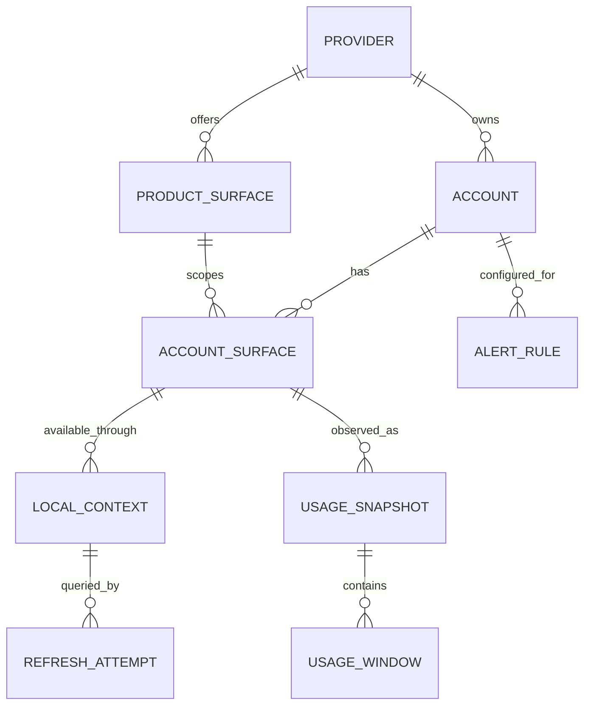

# Data model

> **Implemented through Phase 2:** The compact `CodexContext` record now carries a provider discriminator; `UsageSnapshot` and generic `UsageWindow[]` serve both Codex and Claude. `UsedPercent` is explicitly consumed capacity and `RemainingPercent` is derived for the UI. SQLite migration 3 adds the provider column, defaulting existing rows to Codex. The larger schema below remains historical design research, not the released database. See [Phase 2 record](18-phase2-implementation.md).

> **Phase 1 implementation:** The normalized `UsageSnapshot` / `UsageWindow[]` domain is implemented. SQLite uses compact `contexts`, `snapshots` (normalized JSON), `settings`, and `alert_events` tables. It retains the latest successful snapshot per context; history tables below remain a future design option. This keeps the personal utility small while preserving arbitrary reported windows. No credential table exists. See [implementation record](17-phase1-implementation.md).

## Core concepts

`Provider` is the company; `ProductSurface` is the **metered scope** (Codex subscription quota, ChatGPT chat, Claude subscription quota, OpenAI API organization, Anthropic API organization). `AccessSurface` identifies where a reading came from (Codex CLI, ChatGPT Desktop, Claude Code, Claude Desktop). Claude web/Desktop/Code may share one Claude subscription quota; their readings must not be added together. `LocalContext` is an existing provider-owned auth/config root or active session binding. `Account` is the provider identity verified through a safe interface and given a user alias. `AccountSurface` binds one account to one metered scope. `UsageSnapshot` is one observation for one account/surface; it owns zero or more `UsageWindow`s and optional non-window facts. Do not create placeholder windows for absent provider metrics.

## Domain records

| Record | Required fields | Optional/conditional fields |
| --- | --- | --- |
| `LocalContext` | UUID, connector ID, context kind, canonical path or process binding, discovery method, last verified time | owning executable/version, Windows SID, status, user label |
| `Account` | UUID, provider, user alias, status | provider-safe stable account ID/email/plan; never use email alone as global identity |
| `AccountSurface` | UUID, account ID, metered product surface ID, context bindings | plan/scope label when safely returned |
| `UsageSnapshot` | UUID, account-surface ID, connector/version, fetchedAt UTC, receivedAt UTC, status, source class | access surface, source timestamp, provider request ID, non-secret metadata |
| `UsageWindow` | stable `(provider bucket ID, window discriminator)`, title, semantic kind, source, source confidence, fetchedAt, stale flag, estimated flag | `used`, `remaining`, `limit`, `usedPercent`, unit, `resetAt`, `periodStart`, `periodEnd`, source metadata allowlist |
| `AlertRule` | UUID, account selector, window selector, condition, enabled | threshold, cooldown, quiet hours, channel |
| `RefreshAttempt` | context ID, started/ended, outcome, error category | retryAfter, provider request ID, duration |

`UsageWindow.kind` is an extensible string with known values `SESSION`, `FIVE_HOUR`, `DAILY`, `WEEKLY`, `MONTHLY`, `MODEL_WEEKLY`, `CREDITS`, `REQUESTS`, `TOKENS`, `MONEY`, `UNKNOWN`. Period and unit are independent: a `WEEKLY` window may have unit `PERCENT` when the provider does not disclose a denominator. Credits may be a balance with no reset. A cost report may be a monthly accumulation without a published cap. `usedPercent` is nullable; do not derive it unless `used` and `limit` are same scope, unit, and period with `limit > 0`. Keep provider percentages as reported; do not reverse-engineer absolute usage.

`sourceConfidence` records `official_documented`, `official_implementation`, `provider_ui`, `local_detail`, or `estimated` with a source reference. `stale` is derived from snapshot age and source freshness policy on read, then included in the UI window DTO; it is not a claim supplied by the provider. Preserve unknown metadata only through an explicit non-secret allowlist.

## SQLite schema plan

Tables: `providers`, `product_surfaces`, `accounts`, `account_surfaces`, `local_contexts`, `account_context_bindings`, `usage_snapshots`, `usage_windows`, `alert_rules`, `alert_events`, `settings`, `refresh_history`, and `schema_migrations`. `credentials_refs` is deferred; zero-credential MVP has no such table. Store UTC ISO/epoch consistently and render timezone at the UI edge. Use decimal text or scaled integer for money, not binary float. Add indexes on `(account_surface_id, fetched_at DESC)`, `(context_id, started_at DESC)`, and alert dedupe key.

Retain latest successful snapshot per account and a short bounded history (default 30 days of hourly/downsampled quota points and 14 days refresh diagnostics); purge raw source payload immediately after normalization. Do not persist provider conversation data, token files, browser profiles, or CLI transcript contents. Migrations are forward-only with backup before release upgrade. SQLite WAL is appropriate for one app process with separate read/write tasks; SQLite is not a secret store. [ADR-002](adr/ADR-002-database.md).

## Normalization and identity invariants

- A failed refresh changes connection state, not the last successful numerical snapshot. The UI labels that old snapshot stale.
- `resetAt` is source-provided unless marked estimated. A `periodEnd` from an aggregate usage API is not automatically a quota reset.
- Each window has stable source identity; if provider changes bucket names, preserve the raw ID and treat it as a schema event.
- Deduplicate the same provider account discovered through two local contexts only after a safe stable identity matches. Otherwise ask for a user merge and show uncertainty.
- Never normalize an absent value to `0`, nor `NO` capability to an empty 0% window.
