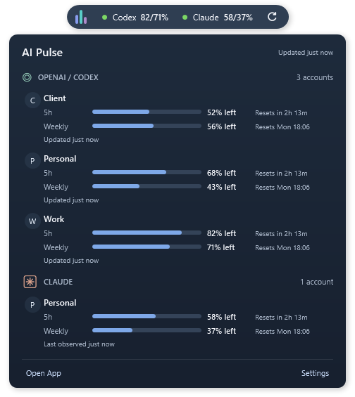

# AI Pulse user guide

AI Pulse is a Windows tray app for watching usage reported by your existing Codex and Claude Code accounts. The overview lists every monitored context; the small notch shows a selected account for each provider. Percentages mean **usage remaining**, not usage spent. A `5h/weekly%` label gives the five-hour and weekly remaining percentages in that order.

The notch, captured from version 1.0.5 with sample data:

See also the [overview screenshot](screenshots/overview-1.0.5.png) and [Accounts screenshot](screenshots/accounts-1.0.5.png).

## Requirements and installation

- Use Windows 10 version 1809 or newer on x64 or ARM64. A Windows version that still receives security updates is recommended.
- Download the [latest GitHub release](https://github.com/mokiwara/Ai-Pulse/releases/latest). The setup executable chooses the correct architecture and installs for the current user without administrator access. The portable executables need no installer. All three include .NET.
- Install and sign in to the provider CLI whose usage you want to see: Codex for OpenAI/Codex, Claude Code for Claude. Claude Code 2.1.251 or newer supports the subscription usage feed used here. AI Pulse does not bundle either CLI or an account.
- The binaries are unsigned, so Windows may identify the publisher as unknown. Check the release's `SHA256SUMS.txt` to verify a downloaded file. A checksum checks file integrity; it does not authenticate the publisher.

For a portable copy, keep the executable in a stable directory if you enable **Start with Windows** or Claude terminal capture. Moving it later can leave those integrations pointing at the old path.

## Connect accounts

1. Sign in using the official Codex or Claude Code CLI first. AI Pulse discovers the usual `%USERPROFILE%\.codex` and `%USERPROFILE%\.claude` contexts, along with conventional nearby context directories.
2. Open **Accounts**. Use **Add existing context** under the appropriate provider for another already authenticated directory. For Codex, select its `CODEX_HOME`; for Claude Code, select its `CLAUDE_CONFIG_DIR`.
3. Select **Test / Refresh** for a Codex context or **Check updates** for a Claude context. The main **Refresh now** control checks all contexts.
4. You can rename or remove a monitored context in AI Pulse. Removing it from AI Pulse does not sign it out of the provider CLI.

For a Claude Code context that needs authentication, **Sign in with Claude Code** starts the official `claude auth login --claudeai` flow in a visible terminal. Claude Code handles the browser and credentials. If you only use Claude Desktop, install and authenticate the Claude Code CLI for the same subscription to let AI Pulse read its shared plan usage. **Open Claude usage** opens the official usage page for a manual check.

## Read the display

- **Overview** shows each account's remaining five-hour and weekly percentages, reported reset times, and last observation state. A provider may supply only one of these windows.
- **Notch** shows one chosen account per provider while collapsed. Expand it to see all monitored accounts. Choose automatic selection, a particular account, or **Hide provider** in **Settings > Notch**.
- **Fresh** means AI Pulse recently received a valid reading. **Stale** means the last valid reading is retained after a failed or delayed check. Unavailable or signed-out accounts may have no percentage yet. The observation time records when AI Pulse read a valid result; it does not prove the provider recalculated its quota then.
- The notch's circular arrow requests a refresh without expanding it. Double-tap **Alt** to hide or restore the notch from any app. Two complete taps must be within 400 ms; holding Alt or using it with another key does not toggle it.

The notch hides temporarily over fullscreen apps. **Settings > Notch > Auto-hide after** offers 5 minutes by default, 10 minutes, or Never. Moving the pointer over the notch restarts the idle timer. Double-Alt brings it back after auto-hide. Closing the main window leaves the tray app running; use **Exit** in the tray menu to stop it.

## Refresh, alerts, and Claude capture

Automatic refresh is on by default at a two-minute interval. Set 1, 2, 5, 10, or 15 minutes in **Settings > Refresh**, or refresh manually from the main window, notch, or tray. A failed reading can remain stale until a later valid response. Provider rate limits and CLI failures can delay another attempt.

In **Settings > Alerts**, select notices at 30%, 15%, or 5% remaining, plus an optional notice on a confirmed reset. Settings save as you change them.

Claude Code's `/usage` command supplies shared subscription usage. You may also enable **terminal capture** for a selected Claude context in **Accounts**. With your confirmation, AI Pulse adds its own status-line command to that context's `settings.json` only when it can do so without replacing an existing custom status line. It keeps a backup. During normal terminal activity Claude Code then provides status-line JSON; AI Pulse retains only normalized usage windows. Terminal capture is optional, and the Claude Desktop Code tab does not execute terminal status lines. Removing a context removes only a directly owned AI Pulse command.

## Data, updates, and uninstall

AI Pulse stores context paths, aliases, settings, normalized usage snapshots, and short diagnostic codes under `%LOCALAPPDATA%\AIUsageHub`. It does not store provider passwords or tokens, send telemetry to an AI Pulse server, or run a listening network service. The provider CLIs contact their providers to fetch usage. The Alt shortcut only recognizes the gesture; it does not record typed text.

Install a newer setup over the existing installation to update. Existing accounts and preferences are preserved. There is no automatic updater. To uninstall, use **Windows Settings > Apps > AI Pulse**. Uninstall removes the app and integrations pointing at the installed executable, while preserving the local data folder and provider logins. If you also want to erase AI Pulse's saved data, exit the app and delete `%LOCALAPPDATA%\AIUsageHub` yourself. Custom commands you composed with AI Pulse's capture command remain yours to maintain.

## If readings do not appear

| What you see | What to check |
| --- | --- |
| Codex CLI missing or cannot launch | Install or update Codex, confirm `codex` runs in a terminal, and try **Test / Refresh**. AI Pulse also checks the selected context path and common install locations. |
| Claude Code signed out | Sign in using Claude Code or use **Sign in with Claude Code** in Accounts, then choose **Check updates**. |
| Claude signed in but waiting for usage | Use **Check updates**, ensure Claude Code is 2.1.251 or newer, and compare the official **Open Claude usage** page. The optional terminal capture can supply readings during terminal activity. |
| Stale or unavailable percentage | Check the CLI's login and connectivity, then retry. AI Pulse keeps the last valid reading after a temporary failure and hides old percentages after their reported reset until a fresh reading arrives. |

Technical details: [provider connectors](06-provider-connectors.md), [security model](09-security.md), and [release verification](production/REVIEW.md).
